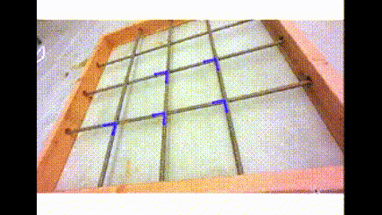
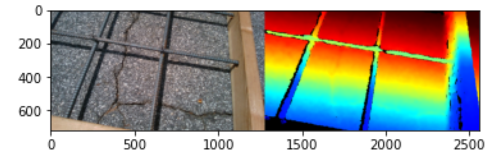
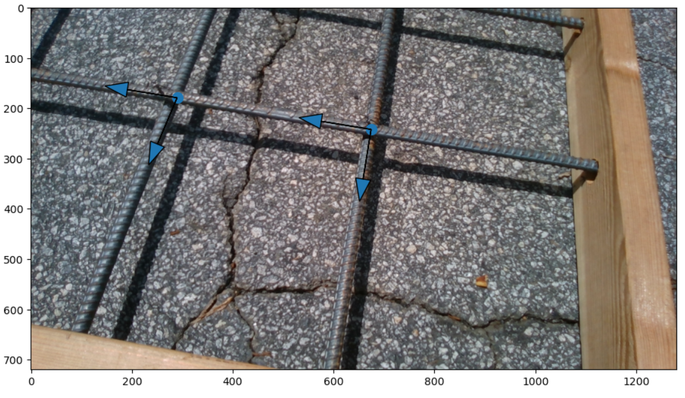
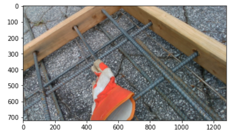
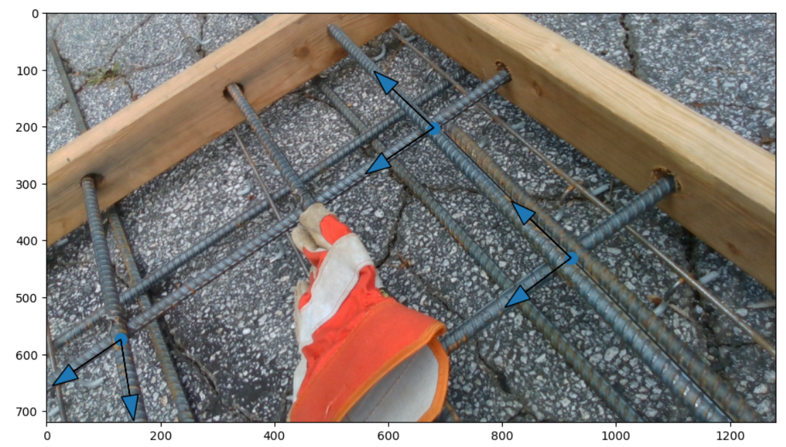

# rebar_intersection_detection

In this project, we propose a novel approach to find rebar intersections in a dense multilayered rebar network using Intel Realsense RGBD camera.
We obtained depth images from the RGBD camera and processed the noisy pointcloud to extract the rebar intersection points and their pose in the global frame.
 
<b>Click on the link to view the results : <a href="https://youtu.be/VeuRKfGhZqA"> Video</a></b>

## Results

For single layer rebar network :  

<table>
  <tr>
      <td align = "center">  </td>
      <td align = "center">  </td>
  </tr>
  <tr>
      <td align = "center"> Raw images from the RGBD</td>
      <td align = "center"> Detected intersections</td>
  </tr>
</table>

 

For multilayer rebar network :  

<table>
  <tr>
      <td align = "center">  </td>
      <td align = "center">  </td>
  </tr>
  <tr>
      <td align = "center"> Raw images from the RGBD</td>
      <td align = "center"> Detected intersections</td>
  </tr>
</table>

